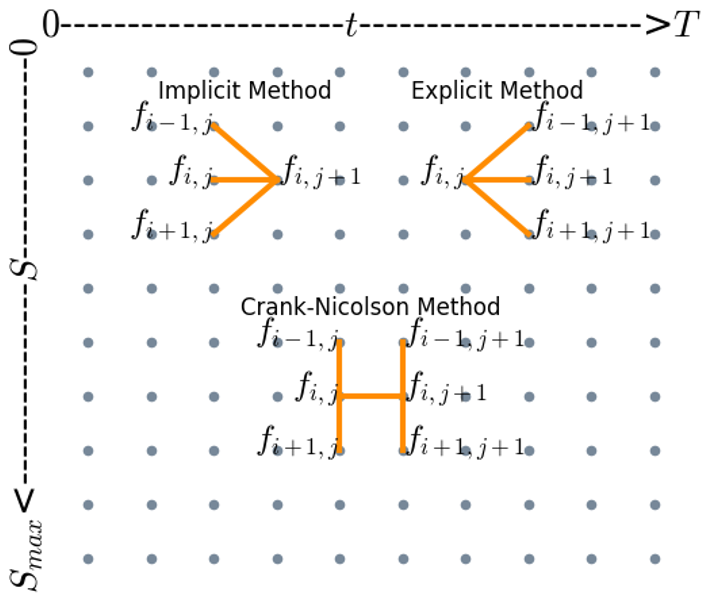

# Numeric Option Pricing

## Theory 

### Wiener Process 
A process where the value of a variable changes over time in an uncertain way is called a stochastic process. Furthermore, a Markov process is a special kind of stochastic process. In this particular process, only the current value of the variable is relevant to the prediction of the future value. A stock price is thought to follow a Markov process (Hull, 2015).

According to Hull (Hull, 2015: p. 304), a process is a Wiener process if two properties hold true: 

- Property 1: The change $∆z$ during a small period of time $∆t$ is $\Delta z = \epsilon \sqrt{\Delta t}$, where $\epsilon$ has a standard normal distribution $\phi(0,1)$.

- Property 2: 	The values of $∆z$ for any two different short intervals of time are independent. 

A generalized Wiener Process has the following form (Hull, 2015)

$$dx=a\ dt+b\ dz$$

In this case, $a$ and $b$ are constant. The term $a\ ∆t$ is known to be the drift rate and $b\ \epsilon∆t$ as the variance rate. One can apply this process to a stock to assume the path of a stock price (Hull, 2015): 

$$dS=\mu Sdt+\sigma dz$$

Here $∆S$ is the change in the stock price $u$ the expected return and $\sigma$ the volatility of the stock. Using this formula and a form of Monte Carlo simulation, one can generate a random outcome of one process for a stock price (Hull, 2015), as is shown in Figure 1. 

     
    <em>
    Figure 1: A generated random example of the change of a stock price.
    </em>

### Itô’s Lemma 
Based on the Wiener process, another more complex process can be defined. This one is called an Itô’s process and is defined as follows (Hull, 2015)

$$dx=a\left(x,\ t\right)dt+b\left(x,t\right)\ dz$$

This time, $a$ and $b$ are not constant but functions from $x$ and t. It can also be written in its discrete form 

$$∆x=a(x,t) ∆t+b(x,t) ϵ∆t$$

This equation, of course, assumes that the drift and the variance rate stay constant when moving from $t$ to $t+∆t$ (Hull, 2015).

Supposing one has a process like above, the variable $x$ has a drift rate of $a(x,t)$ and a variance of rate described by $b(x,t)$. Itô (1951) found that any function $G(x,t)$ follows the process

$$dG=\ \left(\frac{\partial G}{\partial x}a+\frac{\partial G}{\partial t}+\frac{1}{2}\frac{\partial^2G}{\partial x^2}b^2\right)dt+\frac{\partial G}{\partial x}b\ dz$$

### Black-Scholes-Merton Model
As shown before, a Wiener process can be used to simulate the path of a stock price. This is shown in Figure 1. Furthermore, a stock can also follow an Itô’s process. However, to do so, the differential equation needs to be adapted. By combining the Wiener process with it, one can obtain the Black-Scholes-Merton differential equation shown below. (Hull, 2015)

$$df=\ \left(\frac{\partial f}{\partial S}\mu\ S+\frac{\partial f}{\partial t}+\frac{1}{2}\frac{\partial^2f}{\partial x^2}\sigma^2S^2\right)dt+\frac{\partial f}{\partial x}\sigma\ S\ dz$$

where $\mu$ is the expected return, $\sigma$ the volatility of the stock and $S$ the current stock price. The equation can also be written discretely. Also, the same assumption must be made when moving from $t$ to $t+∆t$.

$$d\Delta f = \left( \frac{\partial f}{\partial S} \mu S +\frac{\partial f}{\partial t} + \frac{1}{2}\frac{\partial^{2} f}{\partial^{2} x^{2}} \sigma^{2} S^{2}\right) \Delta t+\frac{\partial f}{\partial x} \sigma S \epsilon \sqrt{\Delta t}$$

Because these equations are differential equations, every formula that solves the equation represents the change of value in an option price according to an Itô process. For European call ($c$) or put ($p$) options with a known dividend yield, this equation can actually be solved analytically, with the result shown below (Morton, 1973) (Hull, 2015).

$$c_{price}=\ S_{0\ }e^{-qT}N\left(d_1\right)-Ke^{-eT}\ N(d_2)$$

$$p_{price}=\ {Ke^{-eT}\ N\left(d_2\right)-S}_{0\ }e^{-qT}N\left(d_1\right)$$

where $d_{1\ }$ and $d_2 is$ are given by

$$d_1=\ \frac{\ln{\left(\frac{S_0}{K}\right)}+\left(r-q+\frac{{\ \sigma}^2}{2}\right)T}{\sigma\ \sqrt T}$$

$$d_2=\ \frac{\ln{\left(\frac{S_0}{K}\right)}+\left(r-q-\frac{{\ \sigma}^2}{2}\right)T}{\sigma\ \sqrt T}$$

In these equations, $S_0$ is the spot price of the stock, $K$ is the strike price of the option, $r$ is the risk-free interest rate, $q$ is the dividend yield of the underlying, $\sigma$ its volatility, and $T$ is the time until the maturity of the stock. If the underlying of the option does not pay dividends, the dividend yield is zero. 

## Numerical Methods
It is very easy to calculate the current price of a European option since it is possible to find a suitable analytical solution for the equation. As mentioned earlier, this is not always the case. For instance, an American option can be exercised at any time, and thus, as of today, an analytical solution for the Black-Scholes-Morten differential equation is known. For problems like this, numerical methods are necessary. These were described already shortly above. To use this method’s formula the discrete version is needed. All the methods described in this section were coded in the course of this paper and can be found in Appendix A. Among others, Press (1992), Ødegaard (2014), and (Hull, 2015) were used for the coding. 

### Binomial Tree
The binomial tree approach is illustrated in Figure 2. The root of the tree is the spot price. Now, there are two possibilities. Either the stock moves up with a certain probability or moves down with a certain probability. From the obtained nodes, the stock can again either go up or down. This goes on as long as it is wanted. Since it makes no difference whether the stock moves first up and then down or vice versa, the two nodes merge. For coding, the Algorithm Thurman (2018) was used. 

     
    <em>
    Figure 2: Illustration of a binomial tree used for option pricing. (Hull, 2015)
    </em>

Since the values for $S_0$ are the same in the last layer, the value of the option for that layer can be calculated with $\max(S_ou^jd^{N-1}-K,\ 0)$ for a call option and $\max(K-S_ou^jd^{N-1},\ 0)$ for a put option. This can be derived from the equations. The next step is not that easy. Now, we need to go back step by step to the beginning of the binomial tree. To give an example, to obtain the value of $S_0u^3$ from Figure 2, $S_0u^4$ and $S_0u^2$ are needed. In the end, the value of the root node is obtained, which is an approximation of the real value of the option. The exact formulas can also be derived. (Hull, 2015)

$$p=\frac{a-d}{u-d}$$

$$u=e^{σ∆t}$$

$$d=e^{-σ∆t}$$

where 

$$a=e^{(r-q)∆t}$$

Hull (2015) specifies the formulas for working a binomial tree for American Options backward. Because an American option can be exercised at any time, a max function is needed for every node. For a call option, this gives

$$f_{i,j}=max(S_{0}u^{j}d^{i-j}-K, e^{-r\Delta t} ( pf_{i+1,j+1}+(1-p)f_{i+1,j})))$$

and for a put option 

$$f_{i,j}=max(K - S_{0}u^{j}d^{i-j}, e^{-r\Delta t} ( pf_{i+1,j+1}+(1-p)f_{i+1,j})))$$

In these equations, $i$ is the time interval, and $j$ identifies the different nodes per time interval. As an example, $S_0u^3$ from Figure 2 would be $f_{3,3}$. When evaluating a European option, the max function is not needed, and it is easy to see that 

$$f_{i,j}=e^{-r\Delta t}pf_{i+1,j+1}+(1-p)f_{i+1,j}$$

### Trinomial Tree
The trinomial tree approach is very similar to the binomial tree approach. The main difference is that one node expands to three new nodes with each new time step, as shown in Figure 3. Because of this, more nodes are merging because they are the same. Because now the value of the option cannot only go up and down but can also stay the same, new formulas are needed (Hull, 2015). The $u$ and $d$ are calculated the same way as before.

$$p_{d}=-\sqrt{\frac{\Delta t}{12 \sigma^{2}}}\left( r-q-\frac{\sigma^{2}}{2} \right)+\frac{1}{6}$$

$$p_m=\frac{2}{3}$$

$$p_{u}=\sqrt{\frac{\Delta t}{12 \sigma^{2}}}\left( r-q-\frac{\sigma^{2}}{2} \right)+\frac{1}{6}$$

The option price at the last layer of the tree is valued exactly the same as for the binomial tree described above. The formula for valuing back a European option is quite similar to the formula for the binomial tree (Hull, 2015)

$$f_{i,j}=e^{-r\Delta t}p_{d}f_{i+1,j+1}+p_{m}f_{i+1,j+1}+p_{u}f_{i+1,j+2}$$

 

     
    <em>
    Figure 3: Illustration of a trinomial tree used for option pricing. (Hull, 2015)
    </em>

### Monte Carlo Simulation
The way of pricing an option with a Monte Carlo simulation is quite different to the other ways of option pricing. In contrast to the other methods discussed in this paper, it is not needed to calculate nodes or build a tree of some kind. The procedure is quite simple and can easily be implemented in Microsoft Excel, as Hull (2015) has shown. First, one calculates the value of the stock after some time 𝑡. To do this, the following formula is needed (Hull, 2015).

$$S(T)=S(0)e^{\left(r-q-\frac{\sigma^2}{2}\right)T+\sigma\epsilon\sqrt T}$$

The problem with this equation is 𝜖 since this is not an exact number. 𝜖 can be simulated by generating a random number and plugging it into the inverse of the normal derivation. After doing that, one can calculate one possible outcome of the equation. However, this is, as just said, just one potential outcome, so it is needed to repeat the process over and over. The higher the number of repetitions, the more exact the price will be. Theoretically, if the number of repetitions comes close to infinity, the result for a European option would be the same as that calculated analytically using the Black-Scholes formulas.

### Finite Difference Methods
Contrary to the methods described above, these are a bit more complex. The presented techniques are also used in physics. Instead of calculating a tree or simulating a normal derivation, these processes rely on building a grid, as shown in Figure 4. 

     
    <em>
    Figure 4: Illustration of a grid that is used for calculating the price of an option using finite difference methods (Hull, 2015)
    </em>

Oppositely to, for instance, the binomial tree, not only one stock price is taken into account, but a certain number of prices between $0$ and $S_{max}$. The $S_{max}$ can be chosen freely. However, it seems simplest to define $S_{max}$ as $2S_0$ since then $S_0$ is exactly in the middle of the grid. The time steps $∆t$ are shown on the horizontal axis. At the end of the grid the option price is evaluated by $max(j∆S-K,0)$ for a call-option and $max(K-j∆S,0)$ for a put option (Hull, 2015) (Ødegaard, 2014). Specially attention should be drawn to the fact that in this case no kind of discountation is made.

The upper and lower border also have to be set. There are different approaches to doing this. The first one which is described by Ødegaard (2014) is simply setting the lower edge to $0$ and the upper edge to $S_{max}$ when pricing a call-option and exactly the other way around when pricing a put-option. Another variant for setting the border conditions is described by Zhang (2017) and is called Dirichlet Condition. Hereby, the edges for a call option are set to 

$$f\left(0,t\right)=0$$

$$f\left(S_{max},t\right)=S_{max}-Ke^{-(T-t)}$$

and for a put-option to 

$$f\left(0,t\right)=Ke^{-r(T-t)}$$

$$f\left(S_{max},t\right)=0$$

A third option also described by Zhang (2017) is Neumann conditions, which are the partial derivative of the option at the boundary and, according to him, tend to be more accurate. To set the conditions, the edges are set so that the following formulas hold true, where M is the number of prices used. 

$$f\left(0,j\right)-2f\left(1,j\right)+f\left(2,j\right)=0$$

$$f\left(M-2,j\right)-2f\left(M-1,j\right)+f\left(M,j\right)=0$$

There are many different ways to calculate the points inside the grid. In this paper, only three are described, namely the implicit finite difference method, the explicit finite difference method, and the Crank-Nicolson method, where the last one is a combination of the first two. The different methods are illustrated in Figure 5. 

     
    <em>
    Figure 5: Illustration of the different finite difference methods (Zhang, 2017)
    </em>

The implicit procedure is using $f\left(i,j+1\right)$ to in some way build equations for $f\left(i-1,j\right)$, $\ f\left(i,j\right)$ and $f\left(i+1,j\right)4. When doing this for every $f$ at one layer, a set of linear equations is obtained. This set can be solved algebraically, and the values for the layer one step further left can be calculated implicitly. The need to solve a set of linear equations can be omitted by calculating $f(i,j)$ explicitly with $f\left(i-1,j+1\right)$, $f\left(i,j+1\right)$ and $f\left(i+1,j+1\right)$. Using this process is computationally more efficient, but it is not as robust as the implicit method (Hull, 2015). Hull (2015) writes very little about the last variant. According to him, this technique is the average of the implicit and explicit method. This can be explained with the trapezoidal formula.

As described previously, the implicit method is building a set of equations that must be solved. The formula needed to do this can be derived if the derivatives are calculated numerically, as described below (Hull, 2015). A similar formula can also be found in Brennan (1977).

$$a_jf_{i,j-1}+b_jf_{i,j}+c_jf_{i,j+1}=\ f_{i+1,j}$$

where 

$$a_j=\frac{1}{2}\left(r-q\right)j∆t-\frac{1}{2}σ^{2}j^{2}∆t$$

$$b_j=1+\sigma^2j^2∆t+r∆t$$

$$c_j=-\frac{1}{2}\left(r-q\right)j∆t-\frac{1}{2}σ^{2}j^{2}∆t$$

The Formula for the explicit method also can be derived as follows (Hull, 2015)

$$f_{i,j}=a_{j}^{\*}f_{i+1,j-1}+b_{j}^{\*}f_{i,j+1}+c^{\*}_{j+1,i+1}$$

where 

$$a_{j}^{*} = \frac{1}{1+r\Delta t}\left( -\frac{1}{2}(r-q)i\Delta t+\frac{1}{2}\sigma^{2}j^{2}\Delta t\right)$$

$$b_{j}^{*} = \frac{1}{1+r\Delta t} (1-\sigma^{2}j^{2}\Delta t)$$

$$a_{j}^{*} = \frac{1}{1+r\Delta t}\left( \frac{1}{2}(r-q)i\Delta t+\frac{1}{2}\sigma^{2}j^{2}\Delta t\right)$$

If using the Crank-Nicolson method, first, a vector is calculated using the explicit method. This vector is then used to calculate the results with the implicit method. The formulas are very similar to the ones above. However, $a_j$, $b$, $c_j$, $aast_j$, $bast_j$ and $cast_j$ need to be changed (Zhang, 2017). The formulas are slightly adapted to fit the equations above and are adapted to include the dividend yield. 

$$a_j=-\frac{1}{4}j∆t(jσ2-(r-d))$$

$$b=1+\frac{1}{2}∆t(j2σ2+(r-d))$$

$$c_j=-\frac{1}{4}j∆t(jσ2+(r-d))$$

$${a^\ast}_j=\frac{1}{4}j∆t(jσ2-(r-d))$$

$${b^\ast}_j=1-\frac{1}{2}∆t(j2σ2+(r-d))$$

$${c^\ast}_j=\frac{1}{4}j∆t(jσ2+(r-d))$$

## Results 

The simulator in this project can calculate option prices for arbitrary European options. However, since some parameters must be chosen for this section, Table 1 presents the example option selected for this section. Please note that $S_0$ represents the *spot price*, $K$ the *strike price*, $t$ the *time*, $r$ the *risk-free interest rate*, $d$ the *dividend*, and $v$ the *volatility*. The *kind* parameter specifies whether the option is a *call* or a *put*.

    <em>Table 1: The parameters for the option used for the results.</em>
    <table>
        <tr>
            <th>$S_0$</th>
            <th>$K$</th>
            <th>$T$</th>
            <th>$r$</th>
            <th>$d$</th>
            <th>$v$</th>
            <th>$kind$</th>
        </tr>
        <tr>
            <td>42</td>
            <td>40</td>
            <td>1</td>
            <td>0.1</td>
            <td>0</td>
            <td>0.2</td>
            <td>call</td>
        </tr>
    </table>

After having defined an example option and, thereby, an underlying stock, it is now possible to simulate one possible value path for this stock, as shown in Figure 1. 

### Analytical Result

Since there exists an analytical solution for european options a price for such options can be calculated directly using the following formula: 

$$
d_{1} = \frac{\ln \left(\tfrac{S}{K}\right) + \left(r - d + \tfrac{1}{2}\sigma^2\right)T}{\sigma \sqrt{T}}
$$

$$
d_{2} = \frac{\ln \left(\tfrac{S}{K}\right) + \left(r - d - \tfrac{1}{2}\sigma^2\right)T}{\sigma \sqrt{T}}
$$

$$
C = S * e^{-dT}\, N(d_{1}) - K e^{-rT}\, N(d_{2})
$$

$$
P = K e^{-rT}\, N(-d_{2}) - S e^{-dT}\, N(-d_{1})
$$

## Bibliography
- Hull, J.C., (2015). Options, Futures, and Other Derivates. 9th ed. New Jersey: Pearson Education, Inc.
- Itô, K., (1951). On Stochastic Differential Equations. New York: American Mathematical Society.
- Morton, R. C., (1973). Theory of rational option pricing. The Bell Journal of Economics and Management Science. 4, 141 – 183. 
- Ødegaard, B. A., (2014). Financial Numerical Recipes in C++. s.l.:s.n.
- Press, W. H., et al., (1992). Numerical Recipes in C: The Art of Scientific Computing. 2nd ed. Cambridge: Press Syndicate of the University of Cambridge.
- Thurman, J., (2018) Implementing the Binomial Option Pricing Model (online) jose josephthurman.com (Viewed 1 March 2021) Available from: http://www.josephthurman.com/binomial3.html 
- [24]	Zhang, Q., (2017) On Pricing Options with Finite Difference Methods (online) quintus-zhang.github.io (Viewed on 6 March 2021) Available form: https://quintus-zhang.github.io/post/on_pricing_options_with_finite_difference_methods/
